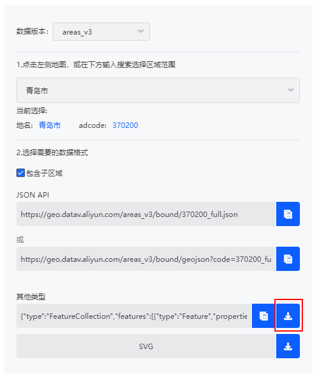

http://datav.aliyun.com/portal/school/atlas/area_selector

从阿里云下载地图





## 数据的格式

```JSON
{
	"type": "FeatureCollection",
	"features": [{
		"type": "Feature",
		"properties": {
			"adcode": 370215,
			"name": "即墨区",
			"center": [120.447352, 36.390847],
			"centroid": [120.524774, 36.482445],
			"childrenNum": 0,
			"level": "district",
			"acroutes": [100000, 370000, 370200],
			"parent": {
				"adcode": 370200
			}
		},
		"geometry": {
			"type": "MultiPolygon",
			"coordinates": [
				[
					[
						[120.65604, 36.322155],
						[120.663002, 36.331778],
						[120.665385, 36.33285],
                        
						// ... ...

						[120.655463, 36.321166],
						[120.65604, 36.322155]
					]
				],
				[
					[
						[120.990039, 36.413342],
						[120.991687, 36.413559],
						[120.992962, 36.414568],
						
                        // ... ...
                        
						[120.987545, 36.413865],
						[120.990039, 36.413342]
					]
				],
				[
					[
						[121.004262, 36.488312],
						[121.004187, 36.489253],
						[121.003815, 36.489885],
						
                        // ... ...
                        
						[121.004113, 36.487726],
						[121.004262, 36.488312]
					]
				],
				
                // ... ...
			]
		}
	}]
}
```

